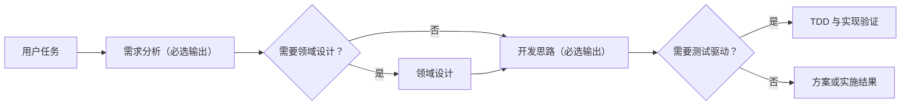

# 开发罗盘

`navigate-software-development` 是一个带固定交付骨架的软件开发方法 Codex Skill。

每个任务都必须完成并输出“需求分析”和“开发思路”；领域设计和测试驱动则根据复杂度与风险按需加入。这样既不会遗漏实现依据，也不会要求简单任务强行走完整 DDD/TDD 流程。

## 它解决什么问题

- 需求还没说清楚就开始改代码；
- 简单 CRUD 被套上完整领域模型；
- 开发方案只有目录清单，没有可验收的纵向切片；
- 测试数量很多，却没有保护关键行为；
- 需求、设计、计划、测试和代码之间无法追踪。

开发罗盘先建立需求与验收基线，再决定是否需要领域设计，随后形成可执行开发思路；只有命中测试门禁时才进入测试驱动。



需求材料已经存在时可以复用，不必重复调查，但最终答复仍会概括本次采用的需求结论与开发方案。用户只要分析与方案时，在开发思路交付后停止，不会擅自编码。

## 四个模块

| 模块 | 执行规则 | 主要产物 |
| --- | --- | --- |
| [需求分析](references/1-requirements-analysis.md) | **必选并输出** | 需求基线、用例、验收契约与未知项 |
| [领域设计](references/2-ddd-design.md) | 复杂规则、状态迁移、模型边界或一致性门禁命中时选择 | 统一语言、Context Map、四色模型、聚合、Port 与一致性合同 |
| [开发思路](references/3-development-planning.md) | **必选并输出** | 现状映射、纵向切片、依赖关系和可执行计划 |
| [测试驱动](references/4-tdd.md) | 实现、缺陷修复、回归保护或测试设计门禁命中时选择 | 测试合同、红—绿—重构循环与验证证据 |
| [走查示例](references/5-worked-example.md) | 首次执行或不确定输出形态时对照 | 技术栈中立的端到端示例(跳过路径 + 全命中路径) |

## 固定骨架，按需增强

- 每次都以固定二级标题 `## 需求分析` 和 `## 开发思路` 输出，不能改成一句路由说明或只在内部推理。
- 简单任务可以缩短两个必选产物，但不能省略核心目标、范围、步骤、验证和风险。
- 简单 CRUD、一次性原型和规则很薄的功能，默认跳过完整领域设计。
- TDD 不依赖 DDD；行为清楚的缺陷在形成需求基线与修复思路后，直接从失败回归用例开始。
- 纯分析、纯方案和非可执行文档，不进入编码或红—绿—重构。
- 设计模式必须由真实变化点驱动，允许结论是“不使用模式”。
- 不确定两个必选产物该写多长、长什么样时，对照 [走查示例](references/5-worked-example.md)（含跳过路径与全命中路径两种形态）。
- 复杂任务可按门禁把独立、无共享状态的子任务委派给 Codex 子智能体并行推进，再扇入合并回两个必选章节（默认 solo，开启 `multi_agent` 后生效；详见 SKILL.md「子智能体委派」节）。

## 安装

克隆到 Codex Skills 目录：

```bash
git clone git@github.com:stackJx/navigate-software-development.git ~/.codex/skills/navigate-software-development
```

更新已安装版本：

```bash
git -C ~/.codex/skills/navigate-software-development pull --ff-only
```

## 使用

可以显式调用 Skill，也可以直接描述需求，由触发描述自动匹配。

### 只做需求与方案

```text
$navigate-software-development
分析会员邀请功能，只输出需求、验收标准和开发思路，不进入 DDD、TDD 或编码。
```

### 处理复杂领域

```text
$navigate-software-development
为订阅计费业务梳理统一语言、限界上下文、聚合、Repository/Port 和跨边界一致性，技术栈未知；同时输出需求分析与后续开发思路。
```

### 修复缺陷

```text
$navigate-software-development
修复重复提交导致重复扣款的问题。先输出预期行为与验收基线、修复思路，再建立稳定失败的回归用例并完成最小修复。
```

### 完整开发

```text
$navigate-software-development
实现批量审批功能。先确认需求与验收用例，根据复杂度判断是否需要领域设计，再形成开发切片并完成验证。
```

## 设计原则

- **固定交付骨架**：需求分析与开发思路始终执行并对用户可见。
- **可选复杂度**：只在门禁命中时加载领域设计与测试驱动模块。
- **事实优先**：区分现有证据、推断、假设和未知项。
- **业务复杂度驱动**：不按目录、后缀或代码行数判断是否“符合 DDD”。
- **纵向交付**：优先完成可演示、可验证、可回滚的最小闭环。
- **测试保护行为**：测试名称表达场景、动作与结果，不追求无意义覆盖率。
- **技术栈中立**：适配目标项目的语言、框架和目录习惯。
- **全程可追踪**：保持需求、设计、开发切片、测试、代码和验证证据之间的关系。

## 输出约定

最终答复按以下顺序交付：

1. **需求分析（必选）**：核心目标、范围、关键用例/验收标准、约束与未知项；
2. **领域设计（可选）**：命中门禁时输出设计合同，否则说明跳过理由；
3. **开发思路（必选）**：现状与缺口、修改范围、纵向步骤、依赖、验证与风险；
4. **TDD（可选）**：命中门禁时输出测试合同或测试证据，否则说明跳过理由；
5. **实施与验证**：用户要求实现时，汇报文件、关键决策、检查与结果；
6. **未决风险**：只列真实未解决项与需用户决定的事项。

即使已经完成编码，最终答复也必须保留两个必选章节，说明实现依据。未选择的 DDD 或 TDD 会标明理由，不会伪造并未执行的产物。

## 目录结构

```text
navigate-software-development/
├── SKILL.md
├── README.md
├── agents/
│   ├── openai.yaml
│   └── navigator-worker.toml
└── references/
    ├── 1-requirements-analysis.md
    ├── 2-ddd-design.md
    ├── 3-development-planning.md
    ├── 4-tdd.md
    └── 5-worked-example.md
```

- `SKILL.md`：主路由、选择门禁和跨阶段规则。
- `agents/openai.yaml`：Codex 界面名称和默认调用提示。
- `agents/navigator-worker.toml`：子智能体委派的预定义工作单元模板（技术栈中立，默认只读；复制到 `~/.codex/agents/` 或项目 `.codex/agents/` 后可按 `agent_type` 引用）。
- `references/`：模块 1、3 固定加载，模块 2、4 按门禁加载，模块 5 按需对照。

## 资料基础

领域设计部分参考并重新提炼了 [fuzhengwei/xfg-ddd-skills](https://github.com/fuzhengwei/xfg-ddd-skills) 中可迁移的思想，同时移除了固定语言、框架、目录、命名后缀和模式数量阈值。需求分析、开发规划与测试驱动部分则以通用软件工程实践为基础整合。

本项目关注的是如何根据任务选择合适的方法，而不是推广某一种固定架构。

## 社区链接

- [LINUX DO](https://linux.do/)
