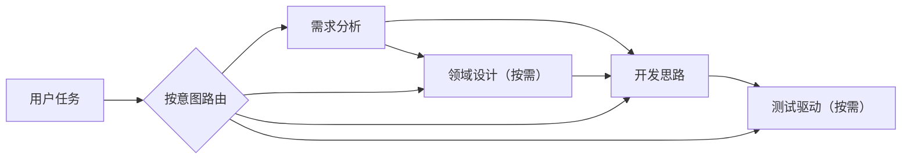

# 开发罗盘

`navigate-software-development` 是一个按需路由软件开发方法的 Codex Skill。

它不会要求每个任务都走完整流程，而是根据当前目标，从需求分析、领域设计、开发规划和测试驱动中选择刚好够用的部分。简单需求保持简单，复杂业务再逐步增加建模和测试投入。

## 它解决什么问题

- 需求还没说清楚就开始改代码；
- 简单 CRUD 被套上完整领域模型；
- 开发方案只有目录清单，没有可验收的纵向切片；
- 测试数量很多，却没有保护关键行为；
- 需求、设计、计划、测试和代码之间无法追踪。

开发罗盘先识别用户意图，再选择最小方法集合，并在对应阶段停止。



这不是固定流水线。需求已经清楚时可以直接进入领域设计或测试；用户只要分析与方案时，不会擅自编码。

## 四个模块

| 模块 | 适用场景 | 主要产物 |
| --- | --- | --- |
| [需求分析](references/1-requirements-analysis.md) | 范围、角色、用例或验收标准不清楚 | 需求基线、用例、验收契约与未知项 |
| [领域设计](references/2-ddd-design.md) | 复杂规则、状态迁移、模型边界、跨上下文一致性 | 统一语言、Context Map、四色模型、聚合、Port 与一致性合同 |
| [开发思路](references/3-development-planning.md) | 需要开发方案、模块梳理、MVP 或实施顺序 | 现状映射、纵向切片、依赖关系和可执行计划 |
| [测试驱动](references/4-tdd.md) | 功能实现、缺陷修复、回归保护或测试设计 | 测试合同、红—绿—重构循环与验证证据 |

## 按需而不是全选

- 只需要“需求分析 + 开发思路”时，执行需求分析后直接形成计划。
- 简单 CRUD、一次性原型和规则很薄的功能，默认跳过完整领域设计。
- TDD 不依赖 DDD；行为清楚的缺陷可以直接从失败回归用例开始。
- 纯分析、纯方案和非可执行文档，不进入编码或红—绿—重构。
- 设计模式必须由真实变化点驱动，允许结论是“不使用模式”。

## 安装

克隆到 Codex Skills 目录：

```bash
git clone git@github.com:stackJx/navigate-software-development.git ~/.codex/skills/navigate-software-development
```

更新已安装版本：

```bash
git -C ~/.codex/skills/navigate-software-development pull --ff-only
```

## 使用

可以显式调用 Skill，也可以直接描述需求，由触发描述自动匹配。

### 只做需求与方案

```text
$navigate-software-development
分析会员邀请功能，只输出需求、验收标准和开发思路，不进入 DDD、TDD 或编码。
```

### 处理复杂领域

```text
$navigate-software-development
为订阅计费业务梳理统一语言、限界上下文、聚合、Repository/Port 和跨边界一致性，技术栈未知。
```

### 修复缺陷

```text
$navigate-software-development
修复重复提交导致重复扣款的问题，先建立稳定失败的回归用例，再完成最小修复与重构。
```

### 完整开发

```text
$navigate-software-development
实现批量审批功能。先确认需求与验收用例，根据复杂度判断是否需要领域设计，再形成开发切片并完成验证。
```

## 设计原则

- **最小路由**：只加载当前任务需要的模块。
- **事实优先**：区分现有证据、推断、假设和未知项。
- **业务复杂度驱动**：不按目录、后缀或代码行数判断是否“符合 DDD”。
- **纵向交付**：优先完成可演示、可验证、可回滚的最小闭环。
- **测试保护行为**：测试名称表达场景、动作与结果，不追求无意义覆盖率。
- **技术栈中立**：适配目标项目的语言、框架和目录习惯。
- **全程可追踪**：保持需求、设计、开发切片、测试、代码和验证证据之间的关系。

## 输出约定

根据实际选中的模块交付：

1. 本次选择了哪些阶段，以及为什么；
2. 对应阶段的分析、设计或测试产物；
3. 修改文件和关键决策；
4. 实际执行的验证及结果；
5. 真实存在的风险和待决问题。

未选择的阶段会标明理由，不会伪造并未执行的设计或测试证据。

## 目录结构

```text
navigate-software-development/
├── SKILL.md
├── README.md
├── agents/
│   └── openai.yaml
└── references/
    ├── 1-requirements-analysis.md
    ├── 2-ddd-design.md
    ├── 3-development-planning.md
    └── 4-tdd.md
```

- `SKILL.md`：主路由、选择门禁和跨阶段规则。
- `agents/openai.yaml`：Codex 界面名称和默认调用提示。
- `references/`：四个按需加载的方法模块。

## 资料基础

领域设计部分参考并重新提炼了 [fuzhengwei/xfg-ddd-skills](https://github.com/fuzhengwei/xfg-ddd-skills) 中可迁移的思想，同时移除了固定语言、框架、目录、命名后缀和模式数量阈值。需求分析、开发规划与测试驱动部分则以通用软件工程实践为基础整合。

本项目关注的是如何根据任务选择合适的方法，而不是推广某一种固定架构。
