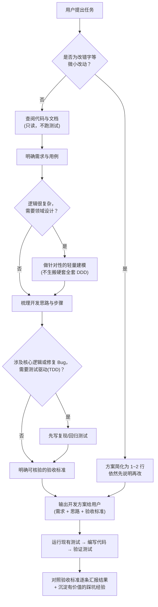

# 开发罗盘 (navigate-software-development)

`navigate-software-development` 是一个帮你规范开发流程的 AI 助手技能（Skill），支持 **Codex**、**Claude Code** 及 **Antigravity** 等工具。

它的核心理念很简单：**先想清楚、说明白，再动手写代码。**

在任何修改代码的操作之前，AI 会先向你汇报**需求分析**、**开发思路**和**验收标准**；根据任务复杂度按需引入领域设计（DDD）或测试驱动（TDD）；仅在你明确要求时才加入 Git Flow 分支与提交管理。这样既能防止“需求没弄懂就瞎改代码”，也不会把简单的小修小补搞得无比繁琐。

## 它解决什么问题

- ❌ 还没把需求搞明白，就急着改代码；
- ❌ 简单的增删改查，硬套复杂的领域建模；
- ❌ 方案写了一堆目录文件，但到底怎么一步步实现和验证全靠猜；
- ❌ 测试用例写了一大堆，核心业务逻辑反而没测到；
- ❌ 改完就忘，踩过的坑和关键设计决策没有沉淀下来，换个会话全丢了。

开发罗盘让你和 AI 在开发前达成共识：先查阅代码、讲清方案与验收条件；你确认清楚后，AI 再开始编码和验证。


```mermaid
flowchart TD
    A["用户提出任务"] --> Q{"是否为改错字等<br/>微小改动？"}
    Q -- "是" --> S["方案简化为 1~2 行<br/>依然先说明再改"]
    Q -- "否" --> X["查阅代码与文档<br/>(只读，不跑测试)"]
    X --> R["明确需求与用例"]
    R --> D{"逻辑很复杂，<br/>需要领域设计？"}
    D -- "是" --> DD["做针对性的轻量建模<br/>(不生搬硬套全套 DDD)"]
    D -- "否" --> P["梳理开发思路与步骤"]
    DD --> P
    P --> T{"涉及核心逻辑或修复 Bug，<br/>需要测试驱动(TDD)？"}
    T -- "是" --> TS["先写复现/回归测试"]
    T -- "否" --> A1["明确可核验的验收标准"]
    TS --> A1
    A1 --> G["输出开发方案给用户<br/>(需求 + 思路 + 验收标准)"]
    S --> G
    G --> B["运行现有测试 → 编写代码 → 验证测试"]
    B --> O["对照验收标准逐条汇报结果<br/>+ 沉淀有价值的踩坑经验"]
```

整个过程分为两个阶段：
1. **准备阶段（只读）**：查代码、理需求、写方案。此时只看不改，也不运行测试（避免跑测试生成临时文件或修改数据库）。
2. **实施阶段（编写与验证）**：方案发给你之后，再开始跑基准测试、写代码、做验证。

如果你的需求已经很清晰，不需要重复调研，但开发前的三项说明（需求分析、开发思路、验收标准）依然不能省。如果你只是想让 AI 出方案或做分析，AI 发完方案后就会停下来，不会擅自改代码。

## 模块介绍

| 模块 | 何时使用 | 主要产出 |
| --- | --- | --- |
| [需求分析](references/1-requirements-analysis.md) | **必选，改代码前必须输出** | 目标范围、具体使用场景、验收条件、待确认问题 |
| [领域设计](references/2-ddd-design.md) | 业务规则复杂、状态流转多、涉及复杂领域模型时按需使用 | 根据复杂度进行轻量设计，提供场景速查，避免过度设计 |
| [开发思路](references/3-development-planning.md) | **必选，改代码前必须输出** | 现状分析、分步实现计划、依赖关系与潜在风险 |
| [测试驱动](references/4-tdd.md) | 修复 Bug、开发核心业务规则、避免回归问题时按需使用 | 编写失败测试（复现问题）→ 编写代码（测试通过）→ 代码重构 |
| [版本控制](references/7-git-flow.md) | **仅在你明确要求时使用**（如指定分支名、要求规范提交或提 PR） | 分支策略、Commit 规范、合并与代码评审流程 |
| [知识沉淀](references/8-knowledge-base.md) | **默认开启**，代码改完后评估是否有值得留存的经验 | 更新项目知识库（默认 `KNOWLEDGE.md`），记录架构决策与踩坑细节 |
| [走查示例](references/5-worked-example.md) | 不确定方案该怎么写时参考 | 提供三种典型场景的完整示例（普通任务 / TDD 任务 / 复杂 DDD 任务） |
| [多任务委派](references/6-delegation.md) | 任务非常庞大且各子模块相互独立时参考 | 子任务拆分、并行处理与结果汇总规则 |

基础骨架只包含必选的「需求分析」与「开发思路」，其余模块按需选用。[tests/gate-cases.md](tests/gate-cases.md) 提供了自测用例，用于检查改动后流程是否保持一致。

## 核心规则

1. **先说明再动手**：在做任何修改代码的动作前，必须先在回复开头按顺序输出三部分内容：`## 需求分析`、`## 开发思路`、`## 验收标准`。
2. **只读先行**：前期可以搜索、读文件、看 Git 状态；但在方案发给用户前，严禁新建/修改文件、安装依赖、提交代码或执行任何有副作用的命令。
3. **测试在方案发出后再跑**：跑测试可能会生成缓存、修改测试数据库或产生构建产物，因此确认方案前只看测试代码，不实跑测试；方案发出后再跑基准测试。
4. **极小改动可简写**：如果只是改个错别字、修注释、改文案等一眼就能看清的小修小补（且不涉及权限、数据迁移或外部接口），这三部分可以各简写成 1~2 句话，但依然要先发出来再改。
5. **不搞过度设计**：普通的 CRUD、临时小脚本直接写代码即可，不强套领域模型（DDD）。只有业务模型复杂、状态机多变时才做针对性设计。
6. **修 Bug 优先测试先行**：遇到 Bug，理清原因后先写一个能稳定复现的失败用例，然后再修代码，确保以后不会再犯。
7. **Git 流程不强加**：除非你明确要求（如“帮我建个 feature 分支”、“用 Conventional Commits 提交”），否则不默认增加复杂的 Git 分支与合并流程。
8. **沉淀真正有价值的经验**：代码改完后，如果发现了非显然的暗坑、关键架构决策或外部接口特殊约定，顺手记录到项目知识库（如 `KNOWLEDGE.md`），持续维护更新，不堆流水账。

## 安装方式

### Codex
```bash
git clone git@github.com:stackJx/navigate-software-development.git ~/.codex/skills/navigate-software-development
```

### Claude Code
```bash
git clone git@github.com:stackJx/navigate-software-development.git ~/.claude/skills/navigate-software-development
```

两个工具都使用时，克隆一份建立软链接即可：
```bash
ln -s ~/.codex/skills/navigate-software-development ~/.claude/skills/navigate-software-development
```

更新已安装版本：
```bash
git -C ~/.codex/skills/navigate-software-development pull --ff-only
```

## 使用示例

可以直接在对话中自然描述需求，也可以显式调用 Skill（Codex 用 `$navigate-software-development`，Claude Code 用 `/navigate-software-development`）。

### 1. 只梳理需求和方案（不做代码修改）
> “分析一下会员邀请功能，帮我梳理需求分析、开发思路和验收标准，暂时不要写代码。”

### 2. 修复 Bug（测试驱动，简单直接）
> “满 100 减 20 的优惠券在订单正好 100 元时无法使用。先理清正确逻辑和验收标准，补一个边界测试用例，再修复问题。”

### 3. 处理复杂业务逻辑（引入领域设计）
> “我们需要做一套订阅计费业务，涉及试用期、自动续费和退款逻辑。开发前请帮我们梳理业务模型、边界与核心规则，并输出需求与开发方案。”

### 4. 完整功能开发
> “实现批量审批功能。先帮我检查现有代码，在改动前输出需求分析、开发思路和验收标准，确认后再开始实现和测试。”

### 5. 极小改动（快速处理）
> “把 README 里的‘限届上下文’改成‘限界上下文’。”
> *(此时会自动简化三项说明，各用 1~2 句话说明，随后完成修改)*

## 设计原则

- **方案前置**：需求、思路与验收标准始终在动代码前让用户看到。
- **复杂度按需**：小功能轻装上阵，大功能严谨拆解，不做无意义的繁琐流程。
- **事实说话**：分清已有代码依据、合理推测和未确认的事实，不胡乱猜测业务逻辑。
- **小步验证**：每一步改动都应该能够明确验证好坏。
- **保护核心行为**：测试关注真实的业务场景和边界，不追求无意义的覆盖率数字。
- **贴合现有项目**：尊重项目已有的目录结构、编码风格和依赖，不生搬硬套外来规范。
- **经验留存**：离开会话就会忘掉的踩坑经验和架构决策，及时更新到项目文档中。

## 输出约定

AI 处理开发任务时，分为前后两次输出：

1. **动手前（方案输出）**：必须先在回复开头给出：
   - `## 需求分析`
   - `## 开发思路`
   - `## 验收标准`
2. **动手后（结果汇报）**：汇报：
   - **实施结果**：修改了哪些文件、做了哪些关键调整。
   - **验收结果**：对照开发前的验收标准逐条说明测试验证情况。
   - **本次沉淀**：更新了哪些知识库文档；如果没有需要沉淀的内容则简述理由。
   - **风险与说明**：是否有未覆盖的边界或需要用户关注的事项。

严禁“先改完代码，最后在回答里假装补一个需求分析”；如果中途发现方案需要大幅调整，应先暂停并更新方案。

## 自检说明

如果你对 `SKILL.md` 或相关参考文档做了修改，可以参考 [tests/gate-cases.md](tests/gate-cases.md) 中的用例对 AI 进行抽查，验证其是否依然遵循“先输出三项方案再改代码”、“按需引入 DDD/TDD/Git Flow”等核心行为。

## 目录结构

```text
navigate-software-development/
├── SKILL.md                          # Skill 主配置文件与核心指令
├── README.md                         # 项目说明文档
├── CHANGELOG.md                      # 版本更新记录
├── LICENSE                           # 开源许可证 (MIT)
├── agents/
│   ├── openai.yaml                   # Codex 界面配置与提示词
│   └── navigator-worker.toml         # 子任务 Worker 模板配置
├── references/                       # 详细参考模块
│   ├── 1-requirements-analysis.md    # 需求分析规范（必选）
│   ├── 2-ddd-design.md               # 领域设计规范（复杂业务按需引入）
│   ├── 3-development-planning.md     # 开发规划与思路（必选）
│   ├── 4-tdd.md                      # 测试驱动开发（按需引入）
│   ├── 5-worked-example.md           # 场景走查示例
│   ├── 6-delegation.md               # 多智能体并行委派（可选）
│   ├── 7-git-flow.md                 # Git 分支与提交规范（用户明确要求时引入）
│   └── 8-knowledge-base.md           # 项目知识库沉淀（改动收尾时维护）
└── tests/
    └── gate-cases.md                 # 规则自查用例
```

## 许可证

本项目基于 [MIT License](LICENSE) 开源。

## 资料基础

领域设计部分参考了 [fuzhengwei/xfg-ddd-skills](https://github.com/fuzhengwei/xfg-ddd-skills) 的思想，并去除了语言、框架和目录强绑定的限制。需求分析、开发规划与测试驱动则基于通用敏捷与软件工程实践整合。

本项目的核心目标是**根据实际任务挑选合适的方法与工具，避免生搬硬套固定架构**。

## 社区交流

- [LINUX DO](https://linux.do/)
