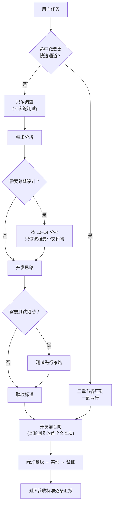

# 开发罗盘

`navigate-software-development` 是一个带固定交付骨架的软件开发方法 Skill，同时适用于 **Codex** 与 **Claude Code**。

每个任务都必须在开发前向用户输出“需求分析”“开发思路”“验收标准”；领域设计与测试驱动根据复杂度与风险按需加入，版本控制（Git Flow）则仅在用户显式声明时加入。这样既避免需求没说清就直接改代码，也不会要求简单任务强行走完整 DDD/TDD 流程，或对未提出的请求强加版本控制流程。

## 它解决什么问题

- 需求还没说清楚就开始改代码；
- 简单 CRUD 被套上完整领域模型；
- 开发方案只有目录清单，没有可验收的纵向切片；
- 测试数量很多，却没有保护关键行为；
- 需求、设计、计划、测试和代码之间无法追踪；
- 每次开发积累的关键决策与坑随会话蒸发，没沉淀成仓库知识。

开发罗盘允许先做只读调查，然后建立需求、方案与验收基线。三项基线对用户可见后才允许产生变更；只有命中测试门禁时才进入测试驱动。


```mermaid
flowchart TD
    A["用户任务"] --> Q{"命中微变更<br/>快速通道？"}
    Q -- "是" --> S["三章节各压到<br/>一到两行"]
    Q -- "否" --> X["只读调查<br/>(不实跑测试)"]
    X --> R["需求分析"]
    R --> D{"需要领域设计？"}
    D -- "是" --> DD["按 L0–L4 分档<br/>只做该档最小交付物"]
    D -- "否" --> P["开发思路"]
    DD --> P
    P --> T{"需要测试驱动？"}
    T -- "是" --> TS["测试先行策略"]
    T -- "否" --> A1["验收标准"]
    TS --> A1
    A1 --> G["开发前合同<br/>(本轮回复的首个文本块)"]
    S --> G
    G --> B["绿灯基线 → 实现 → 验证"]
    B --> O["对照验收标准逐条汇报"]
```

图中 `开发前合同` 之上属**阶段 A**（只读），之下属**阶段 B**（可写）。分界线是硬的：**运行测试也算阶段 B**——测试会写缓存、建测试库或生成覆盖率产物，所以绿灯基线在合同发出后才建立，阶段 A 判断 TDD 门禁时只读测试文件与既有 CI 结果。

需求材料已经存在时可以复用，不必重复调查，但三项开发前合同仍不能省略。用户只要分析与方案时，在合同交付后停止，不会擅自编码。

## 模块

| 模块 | 执行规则 | 主要产物 |
| --- | --- | --- |
| [需求分析](references/1-requirements-analysis.md) | **必选，开发前输出** | 需求基线、用例、验收契约与未知项 |
| [领域设计](references/2-ddd-design.md) | 复杂规则、状态迁移、模型边界或一致性门禁命中时选择 | 按 L0–L4 投入分档输出对应最小交付物；含场景速查，命中不必通读 |
| [开发思路](references/3-development-planning.md) | **必选，开发前输出** | 必给四项 + 按需七项；现状映射、纵向切片、依赖关系 |
| [测试驱动](references/4-tdd.md) | 实现、缺陷修复、回归保护或测试设计门禁命中时选择 | 测试合同、红—绿—重构循环与验证证据 |
| [版本控制](references/7-git-flow.md) | **仅用户显式声明**版本控制/分支/提交/PR/评审/合并保护时选择 | 按 L0–L2 投入分档输出分支模型、提交规范与保护策略；含场景速查 |
| [知识沉淀](references/8-knowledge-base.md) | **默认开启+过滤**，每次产生代码变更的开发收尾评估，有价值才写 | 仓库知识库（默认 `KNOWLEDGE.md`）；纳入/排除清单、条目结构、去重凝聚规则 |
| [走查示例](references/5-worked-example.md) | 首次执行或不确定输出形态时对照 | 三种门禁组合的端到端示例(全跳过 / TDD 单命中 / 全命中) |
| [子智能体委派](references/6-delegation.md) | 仅在考虑并行执行时读取 | 委派门禁、平台能力映射、降级规则与扇入验收 |

方法骨架只有必选的需求分析与开发思路两个模块，其余按门禁加载。[tests/gate-cases.md](tests/gate-cases.md) 提供门禁回归用例，改动 SKILL.md 后可用它自查判定是否漂移。

## 固定骨架，按需增强

- 每次都在首个变更动作前，以固定顺序输出 `## 需求分析`、`## 开发思路`、`## 验收标准`；三个标题必须是该轮回复的首个文本块。
- 搜索、读文件和查看 Git 状态等只读调查可以先做；编辑、格式化、生成、安装、提交、推送和外部写操作必须等合同输出后。
- **运行测试属于阶段 B**。测试通常会写缓存、建测试库或生成覆盖率产物，因此绿灯基线在合同发出后建立；阶段 A 判断 TDD 门禁时只读测试文件与既有 CI 结果。
- 简单任务可以缩短三个必选产物，但不能省略核心目标、范围、步骤、验证和风险。
- **微变更快速通道**：单文件 + 无行为变更 + 可一眼核验 + 不触及权限/数据正确性/迁移/外部契约/依赖版本，四条全中时三章节可各压到一到两行——仍在变更前输出，不跳过门禁。
- 简单 CRUD、一次性原型和规则很薄的功能，默认跳过完整领域设计；命中时按 L0–L4 分档只做该档的最小交付物。
- TDD 不依赖 DDD；行为清楚的缺陷在形成需求基线与修复思路后，直接从失败回归用例开始。两个门禁彼此独立，「TDD 命中 + DDD 跳过」是最常见的组合。Git Flow 与两者同样独立，仅在用户显式声明时启用。
- Git Flow 与 TDD、DDD 独立；**仅在用户显式声明版本控制/分支/提交/PR 时命中**，命中后按 L0–L2 分档只做该档最小交付物，允许结论是「直接主干提交」。未显式声明则默认跳过——即便多人协作或有共享主干。
- 纯分析、纯方案和非可执行文档，不进入编码或红—绿—重构。
- 设计模式必须由真实变化点驱动，允许结论是“不使用模式”。
- 不确定三个必选产物该写多长、长什么样时，对照 [走查示例](references/5-worked-example.md)（三种门禁组合各一例）。
- 复杂任务可按门禁把独立、无共享状态的子任务委派给子智能体并行推进，再扇入合并回三个必选章节。默认 solo，平台差异与降级规则见 [子智能体委派](references/6-delegation.md)。
- **知识沉淀默认开启**：每次产生代码变更的开发，收尾评估是否有"离开代码就会丢失、未来会被再次需要"的知识，有则凝聚进仓库知识库（默认 `KNOWLEDGE.md`），无则跳过写理由；是被凝聚的当前事实，不是 append-only 流水账。

## 安装

### Codex

```bash
git clone git@github.com:stackJx/navigate-software-development.git ~/.codex/skills/navigate-software-development
```

### Claude Code

```bash
git clone git@github.com:stackJx/navigate-software-development.git ~/.claude/skills/navigate-software-development
```

两边都用时，克隆一次再软链接，避免维护两份：

```bash
ln -s ~/.codex/skills/navigate-software-development ~/.claude/skills/navigate-software-development
```

更新已安装版本：

```bash
git -C ~/.codex/skills/navigate-software-development pull --ff-only
```

## 使用

可以显式调用 Skill，也可以直接描述需求，由触发描述自动匹配。显式调用语法按平台：Codex 用 `$navigate-software-development`，Claude Code 用 `/navigate-software-development`。下列示例统一用 `$` 书写。

### 只做需求与方案

```text
$navigate-software-development
分析会员邀请功能，只按顺序输出需求分析、开发思路和验收标准，不进入 DDD、TDD 或编码。
```

### 修复缺陷（最常见：TDD 命中、DDD 跳过）

```text
$navigate-software-development
满 100 减 20 的券，订单金额正好 100 元时用不了。先给预期行为与验收基线，再补边界回归用例并完成最小修复。
```

### 处理复杂领域

```text
$navigate-software-development
为订阅计费业务梳理统一语言、限界上下文、聚合、Repository/Port 和跨边界一致性，技术栈未知；开发前按顺序输出需求分析、开发思路与验收标准。
```

### 完整开发

```text
$navigate-software-development
实现批量审批功能。允许先只读检查仓库，但任何修改前先输出需求分析、开发思路和验收标准，再按合同开发并逐项验证。
```

### 微变更

无行为变更的小改动会自动走快速通道，三章节各压到一到两行，但仍在编辑前输出：

```text
把 README 里的「限届上下文」改成「限界上下文」。
```

## 设计原则

- **前置开发合同**：需求分析、开发思路与验收标准始终在变更前对用户可见。
- **可选复杂度**：只在门禁命中时加载领域设计与测试驱动模块。
- **投入分档**：命中 DDD 也只做对应档位的最小交付物，不为完整而铺满全套建模。
- **事实优先**：区分现有证据、推断、假设和未知项。
- **业务复杂度驱动**：不按目录、后缀或代码行数判断是否“符合 DDD”。
- **纵向交付**：优先完成可演示、可验证、可回滚的最小闭环。
- **测试保护行为**：测试名称表达场景、动作与结果，不追求无意义覆盖率。
- **技术栈中立**：适配目标项目的语言、框架和目录习惯；示例中残留的栈特征会显式标注来源。
- **全程可追踪**：保持需求、设计、开发切片、测试、代码和验证证据之间的关系。
- **知识可沉淀**：把离开代码就会丢失的决策、坑与约定凝聚进仓库知识库，随代码留存共享，而非随会话蒸发。
- **门禁可回归**：判定规则本身有回归用例，方法改动不靠记忆保证一致。

## 输出约定

开发请求采用两次交付。

第一次是**开发前消息**，必须在任何变更前按顺序输出：

1. `## 需求分析`
2. `## 开发思路`
3. `## 验收标准`

位置判据是可机械核验的：三个标题必须是**该轮回复的首个文本块**，其后才允许出现写操作。改成加粗、合并成一节、或只写进内部推理，都不算数。

第二次是**开发后结果**，只汇报实际修改、逐条验收证据、本次沉淀（写入的知识库条目或跳过理由）、偏差和未决风险。不会先开发再在最终答复里补写分析，也不会悄悄修改开发前基线；实施中若范围或方案变化，会先暂停并重新输出修订合同。

微变更快速通道只压缩篇幅，不改变上述两次交付的结构——三个标题仍然出现，仍然在首个变更动作之前。

## 自检

改动 `SKILL.md` 或任一 reference 后，用 [tests/gate-cases.md](tests/gate-cases.md) 自查门禁判定是否漂移。把用例的「输入」逐条发给加载了本 Skill 的模型，对照四项检查：是否输出三章节、DDD 是否命中及档位、TDD 是否命中、默认停止点。

覆盖五组：门禁组合、微变更快速通道、阶段边界、委派降级、不应触发。历史上最容易被改坏的几处在该文件的「已知易错点」一节。

方法骨架与门禁行为的变化记录见 [CHANGELOG.md](CHANGELOG.md)，版本语义按判定行为而非文档字数划分。

## 目录结构

```text
navigate-software-development/
├── SKILL.md
├── README.md
├── CHANGELOG.md
├── LICENSE
├── agents/
│   ├── openai.yaml
│   └── navigator-worker.toml
├── references/
│   ├── 1-requirements-analysis.md
│   ├── 2-ddd-design.md
│   ├── 3-development-planning.md
│   ├── 4-tdd.md
│   ├── 5-worked-example.md
│   ├── 6-delegation.md
│   ├── 7-git-flow.md
│   └── 8-knowledge-base.md
└── tests/
    └── gate-cases.md
```

- `SKILL.md`：主路由、选择门禁、变更动作边界、开发前合同自检表。
- `CHANGELOG.md`：门禁行为变化记录；版本语义按判定行为而非文档字数。
- `agents/openai.yaml`：Codex 界面名称和默认调用提示。
- `agents/navigator-worker.toml`：子智能体委派的预定义工作单元模板（技术栈中立，默认只读；复制到 `~/.codex/agents/` 或项目 `.codex/agents/` 后可按 `agent_type` 引用）。
- `references/`：模块 1、3 固定加载，模块 2、4、7 按门禁加载，模块 8 默认开启（收尾按值得沉淀过滤维护知识库），模块 5 按需对照，模块 6 仅在考虑并行时加载。
- `tests/gate-cases.md`：门禁回归用例，改动方法骨架后自查判定漂移。

## 许可证

本项目使用 [MIT License](LICENSE)。

## 资料基础

领域设计部分参考并重新提炼了 [fuzhengwei/xfg-ddd-skills](https://github.com/fuzhengwei/xfg-ddd-skills) 中可迁移的思想，同时移除了固定语言、框架、目录、命名后缀和模式数量阈值。需求分析、开发规划与测试驱动部分则以通用软件工程实践为基础整合。

本项目关注的是如何根据任务选择合适的方法，而不是推广某一种固定架构。

## 社区链接

- [LINUX DO](https://linux.do/)
