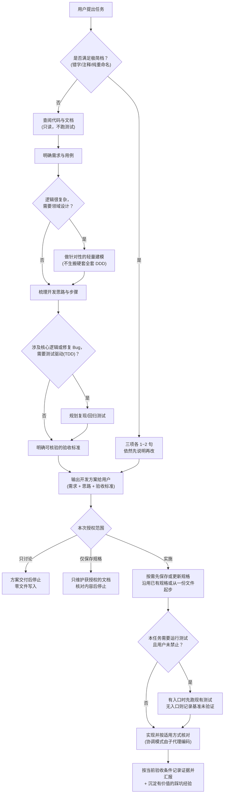

# 开发罗盘 (navigate-software-development)

`navigate-software-development` 是一个帮你规范开发流程的 AI 助手技能（Skill），支持 **Codex**、**Claude Code** 及 **Antigravity** 等工具。

它的核心理念很简单：**先想清楚、说明白，再动手写代码。**

默认在任何写操作之前，AI 会先向你汇报**需求分析**、**开发思路**和**验收标准**；用规格驱动开发（SDD）把验收条件、任务、实现和证据串起来，需要跨会话推进时再保存规格。领域设计（DDD）和测试驱动（TDD）按需引入；仅在你明确要求时才加入 Git Flow 分支与提交管理。小改动仍可只用对话中的三项说明。本文的方案前置与三标题要求均以 [SKILL.md 的方案输出协议](SKILL.md#方案输出协议本-skill-内部优先)为准，明确禁止方案或撤销技能时，按该协议的用户覆盖规则执行。

## 它解决什么问题

- ❌ 还没把需求搞明白，就急着改代码；
- ❌ 简单的增删改查，硬套复杂的领域建模；
- ❌ 方案写了一堆目录文件，但到底怎么一步步实现和验证全靠猜；
- ❌ 测试用例写了一大堆，核心业务逻辑反而没测到；
- ❌ 改完就忘，踩过的坑和关键设计决策没有记录留存，换个会话全丢了。

开发罗盘让你和 AI 在开发前先达成共识：先查阅代码、讲清方案与验收条件。默认流程如下；你已要求实现时，AI 发出方案后即可开始编码和验证；存在阻塞性未知项、高风险或不可逆操作，或你明确要求审批时，才暂停等待确认。


```mermaid
flowchart TD
    A["用户提出任务"] --> Q{"是否满足极简档？<br/>(错字/注释/纯重命名)"}
    Q -- "是" --> S["三项各 1~2 句<br/>依然先说明再改"]
    Q -- "否" --> X["查阅代码与文档<br/>(只读，不跑测试)"]
    X --> R["明确需求与用例"]
    R --> D{"逻辑很复杂，<br/>需要领域设计？"}
    D -- "是" --> DD["做针对性的轻量建模<br/>(不生搬硬套全套 DDD)"]
    D -- "否" --> P["梳理开发思路与步骤"]
    DD --> P
    P --> T{"涉及核心逻辑或修复 Bug，<br/>需要测试驱动(TDD)？"}
    T -- "是" --> TS["规划复现/回归测试"]
    T -- "否" --> A1["明确可核验的验收标准"]
    TS --> A1
    A1 --> G["输出开发方案给用户<br/>(需求 + 思路 + 验收标准)"]
    S --> G
    G --> U{"本次授权范围"}
    U -- "只讨论" --> END["方案交付后停止<br/>零文件写入"]
    U -- "仅保存规格" --> DOC["只维护获授权的文档<br/>核对内容后停止"]
    U -- "实施" --> SPEC["按需先保存或更新规格<br/>沿用已有规格或从一份文件起步"]
    SPEC --> C{"本任务需要运行测试<br/>且用户未禁止？"}
    C -- "是" --> B["有入口时先跑现有测试<br/>无入口则记录基准未验证"]
    C -- "否" --> I["实现并按适用方式核对<br/>(协调模式由子代理编码)"]
    B --> I
    I --> O["按当前验收条件记录证据并汇报<br/>+ 沉淀有价值的踩坑经验"]
```

整个过程分为两个阶段：
1. **准备阶段（只读）**：查代码、理需求、写方案。此时只看不改，也不运行测试（避免跑测试生成临时文件或修改数据库）。
2. **执行阶段（按授权推进）**：已要求实施时，方案发给你之后按需先维护规格；本任务需要运行测试且你未禁止时，再运行现有测试建立基准，然后实施与验证。极简静态改动可只核对内容与 diff；协调模式下由主会话派发实现、审查和验收。仅要求保存规格时，只完成文档并核对内容。

如果你的需求已经很清晰，不需要重复调研；方案输出协议生效时，写操作前的三项说明（需求分析、开发思路、验收标准）仍需输出。只要求方案或分析时，AI 发完方案后停止，默认不写任何文件；明确要求保存规格但暂不实现时，也不会运行测试或执行 Git 写操作。

## 执行模式

默认模式保持原有流程：主会话可以直接实现，也可以按任务需要委派子代理。你明确要求“协调模式”或“主会话不编码，具体编码必须交给子代理”时，才启用**协调模式**。

协调模式下，主会话负责调研、设计、拆分、派发、审查、验证和汇报；生产代码、测试、脚本、配置、格式化、返工和代码冲突解决全部由子代理完成。即使只改一行，也必须委派一个实现代理，但不要求多个代理并行。主会话可以运行不改写源码的验证，不能先写好完整实现补丁再让子代理照贴，也不能借代码生成器或自动修复命令间接实现。

按方案输出协议完成准备后，再按明确的范围、文件归属和验收条件派发实现。同一文件的修改串行进行，主会话核对实际 diff 和验证证据，不合格则交回子代理修正。代理不可用、失败或只有只读权限时，先核查已有文件与修改，再恢复或更换代理；确实无法继续则报告阻塞，不能自动改由主会话编码。

模式在当前任务的后续轮次沿用，直到你明确切回默认模式。一次性的子代理请求或并行调研不算切换模式；纯分析任务也不会因为启用协调模式而被强行转成编码任务。

> 启用：“本任务使用协调模式，主会话只负责规划和验收，具体编码必须由子代理完成。”
>
> 退出：“本任务切回默认模式，主会话可以直接编码。”

仓库为 Claude Code 和 Codex 各提供一套职责相同的子代理模板：只读分析的 `navigator-worker` 与可写实现的 `navigator-implementer`（Claude Code 版见 [`agents/claude/`](agents/claude/)，Codex 版见 [`agents/codex/`](agents/codex/)）。模板需要按下方「安装方式」手动接入；模板文件不代表代理已注册或可调用，实际工具与权限决定可用性，Skill 不会自动修改你的全局配置。详细分工见 [委派规则](references/6-delegation.md)。

## SDD 规格与任务追踪

SDD（Spec-Driven Development，规格驱动开发）让三项方案成为具体实施与最终验收时持续核对的依据，不增加第四个必选标题。小改动只保留对话中的三项方案即可；涉及跨会话推进、多阶段交付、复杂规则约定（含接口或行为）或需要后续接续与交接时，再按授权将规格保存为文件。优先维护项目已有相关需求或规格文档；没有既有约定时默认使用 `docs/specs/<feature>.md`，从一份文件起步。

保存的规格文档中记录目标范围、修订版本、稳定的验收条件编号（如 `AC-1`，即 Acceptance Criteria 验收条件）、任务及其关联的文件和依赖，以及实施状态与验证证据，形成 **验收条件（AC）→ 任务 → 实际修改 → 验证证据** 的对应关系。仅仅勾选“完成”不能代替真实验证；测试未执行、环境报错或只有代理口头自述时，应如实保持未验证状态。

需求发生变化时，先说明冲突与修订原因，更新受影响的验收条件、任务及失效证据，受影响代理暂停相关写入（含代码、配置、测试与文档），再继续实施。工作中断后接续时，先核对最新用户要求、当前规格修订版本、实际文件修改（diff，含代码、配置、测试与文档）、当时执行验证的环境与旧证据是否依然适用，再确认剩余任务；不能直接照搬旧文档中的“已完成”状态。

SDD 负责明确规格与追踪进度，DDD 负责需要的领域设计，TDD 负责适用场景的失败先行测试（涵盖业务规则、Bug 修复与边界情况），Git Flow 则按用户明确要求管理分支与提交。它们不改变执行分工：默认模式下可由主会话直接实现，协调模式下依然由实现子代理编写代码，共享的需求与计划等规格文档由主会话统一维护；协调模式下若文档包含可执行脚本、实际配置或完整实现，仍由实现子代理承担。保存规格本身不代表获得了实施、Git 提交或发布的授权，也不强制安装新 CLI、固定拆成三份文件或增加逐阶段审批。文档模板与完整规则见 [SDD 指南](references/9-spec-driven-development.md)。

## 模块介绍

| 模块 | 何时使用 | 主要产出 |
| --- | --- | --- |
| [需求分析](references/1-requirements-analysis.md) | **必选，按方案输出协议呈现** | 目标范围、具体使用场景、验收条件、待确认问题 |
| [领域设计](references/2-ddd-design.md) | 业务规则复杂、状态流转多、涉及复杂领域模型时按需使用 | 根据复杂度进行轻量设计，提供场景速查，避免过度设计 |
| [开发思路](references/3-development-planning.md) | **必选，按方案输出协议呈现** | 现状分析、分步实现计划、依赖关系与潜在风险 |
| [测试驱动](references/4-tdd.md) | 修复 Bug、开发核心业务规则、避免回归问题时按需使用 | 编写失败测试（复现问题）→ 编写代码（测试通过）→ 代码重构 |
| [SDD 规格与追踪](references/9-spec-driven-development.md) | 以三项方案作为全程实施与核对的依据；跨会话、多阶段、复杂规则约定或用户明确要求时按授权保存规格到文件 | 当前规格修订版本、AC 与任务对应关系、验证证据、变更与接续记录 |
| [版本控制](references/7-git-flow.md) | **仅在你明确要求时使用**（如指定分支名、要求规范提交或提 PR） | 分支策略、Commit 规范、合并与代码评审流程 |
| [知识沉淀](references/8-knowledge-base.md) | **默认开启**，代码改完后评估是否有值得留存的经验 | 优先更新已有约定文件（`CLAUDE.md`/`AGENTS.md`/`docs/`），没有时新建 `KNOWLEDGE.md` |
| [走查示例](references/5-worked-example.md) | 不确定方案该怎么写时参考 | 提供三种典型场景的完整示例（普通任务 / TDD 任务 / 复杂 DDD 任务） |
| [子代理委派](references/6-delegation.md) | 默认模式按需委派；协调模式的实现任务必须委派 | 文件归属、实现派发、审查验收与失败处理；独立任务可并行 |

默认的方案骨架包含「需求分析」「开发思路」「验收标准」三项；SDD 将它们作为实施与验收的全程依据，规格文件按需保存，DDD、TDD、Git Flow 分别判断是否选用。协调模式额外要求将具体实现委派给子代理。[tests/gate-cases.md](tests/gate-cases.md) 提供了自测用例，用于检查改动后流程是否保持一致。

## 核心规则

1. **编辑前先说明改动**：方案输出协议生效时，在做任何写操作之前，先在单条主会话回复中按顺序向你输出三部分内容：`## 需求分析`、`## 开发思路`、`## 验收标准`。
2. **只读先行**：前期可以搜索、读文件、看 Git 状态；方案输出协议生效时，方案发给用户前不新建/修改文件、安装依赖、提交代码或执行任何有副作用的命令。
3. **测试按需运行并遵守方案输出协议与实施授权**：仅保存规格或你明确禁止运行测试时，都不跑测试；方案输出协议生效时，测试也需等方案发出后再运行。跳过 TDD 不代表跳过必要的回归；只要求“不新增测试”也不妨碍按需运行现有测试。没有现有可运行入口时如实记录基准未验证，不能写成测试通过。
4. **篇幅按复杂度分档**：极简档（错字、注释、纯重命名等一眼可确认的单文件改动）三项各 1~2 句；标准档（目标明确的 Bug 或小功能，可含简单跨模块改动）各 3~5 条要点；完整档（复杂业务规则、复杂状态流转、跨模块一致性或需求不明确）完整展开。普通的“直接改”“别啰嗦”压缩篇幅，要求“详细方案”升到完整档，三标题仍按方案输出协议前置。
5. **不搞过度设计**：普通的 CRUD、临时小脚本直接写代码即可，不强套领域模型（DDD）。只有业务模型复杂、状态机多变时才做针对性设计。
6. **修 Bug 优先测试先行**：适用且你未禁止新增或运行测试时，理清原因后先写一个能稳定复现的失败用例，再修代码并验证；受测试限制的部分如实记录未验证项。
7. **Git 流程不强加**：除非你明确要求（如“帮我建个 feature 分支”、“用 Conventional Commits 提交”），否则不默认增加复杂的 Git 分支与合并流程。
8. **留存真正有价值的经验**：代码改完后，如果发现了不容易直接看出的暗坑、关键架构决策或外部接口特殊约定，优先写进项目已有的约定文件（`CLAUDE.md`、`AGENTS.md`、`docs/` 等），没有时才新建 `KNOWLEDGE.md`；持续维护更新，不堆流水账。
9. **遵守执行模式**：协调模式下，所有具体编码都由子代理完成，主会话负责审查验收；实现子代理自行完成任务，不创建更多子代理，也不受主会话禁编码规则约束。
10. **维护当前规格**：需要保存规格时优先沿用已有文件；按当前有效验收条件（AC）实施和验收，需求实质变化时先更新方案，接续任务时先比对实际文件修改与已有证据，不为通过验证降低验收要求。

## 安装方式

### Codex
```bash
git clone git@github.com:stackJx/navigate-software-development.git ~/.codex/skills/navigate-software-development
```

### Claude Code
```bash
git clone git@github.com:stackJx/navigate-software-development.git ~/.claude/skills/navigate-software-development
```

两个工具都使用时，克隆一份建立软链接即可：
```bash
ln -s ~/.codex/skills/navigate-software-development ~/.claude/skills/navigate-software-development
```

更新已安装版本：
```bash
git -C ~/.codex/skills/navigate-software-development pull --ff-only
```

### 接入子代理（使用协调模式时需要）

Claude Code：把模板软链接到用户级（或项目级 `.claude/agents/`）代理目录，然后在会话中用 `/agents` 确认已加载：
```bash
mkdir -p ~/.claude/agents
ln -s ~/.claude/skills/navigate-software-development/agents/claude/navigator-worker.md ~/.claude/agents/
ln -s ~/.claude/skills/navigate-software-development/agents/claude/navigator-implementer.md ~/.claude/agents/
```

Codex：先核对当前平台和版本是否支持自定义代理目录。支持时，把模板复制到用户级 `~/.codex/agents/`（或受信任项目的 `.codex/agents/`）：
```bash
mkdir -p ~/.codex/agents
cp ~/.codex/skills/navigate-software-development/agents/codex/*.toml ~/.codex/agents/
```

若实际工具提供 `spawn_agent.agent_type`，可按模板中的 `name` 字段选择 `navigator_worker` / `navigator_implementer`；没有该参数或加载机制时，把职责、范围和验收要求传给当前可用的子代理，并核实其工具与写权限。上述模板曾在 Claude Code 与 Codex CLI 0.149 的测试环境中验证 worker 拒绝写任务、implementer 执行修改；这一历史结果不保证当前桌面版、CLI 或其他宿主拥有相同接口。模板不会自行安装或更改全局配置。

## 使用示例

可以直接在对话中自然描述需求，也可以显式调用 Skill（Codex 用 `$navigate-software-development`，Claude Code 用 `/navigate-software-development`）。

### 1. 只讨论 SDD 方案（零文件写入）
> “为会员邀请功能梳理轻量 SDD 方案，只在对话中讨论需求、思路和验收标准，不创建或修改文件，也不实施。”

### 2. 修复 Bug（测试驱动，简单直接）
> “满 100 减 20 的优惠券在订单正好 100 元时无法使用。先理清正确逻辑和验收标准，补一个边界测试用例，再修复问题。”

### 3. 处理复杂业务逻辑（引入领域设计）
> “我们需要做一套订阅计费业务，涉及试用期、自动续费和退款逻辑。开发前请帮我们梳理业务模型、边界与核心规则，并输出需求与开发方案。”

### 4. 完整功能开发
> “实现批量审批功能。先帮我检查现有代码，在改动前输出需求分析、开发思路和验收标准，确认后再开始实现和测试。”

### 5. 极简档改动（快速处理）
> “把 README 里的‘限届上下文’改成‘限界上下文’。”
> *(此时会自动简化三项说明，各用 1~2 句话说明，随后完成修改)*

### 6. 想少看点方案
> “满 100 减 20 的券正好 100 元用不了，直接改就行。”
> *(会压缩篇幅：三项各 1~3 条要点，但标题仍在改代码前给出，回归测试照常规划)*

### 7. 保存规格，暂不实现
> “把满减券边界修复的规格保存到 `docs/specs/coupon.md`，列出 AC 和待实施任务。只写这份文档，不改代码、不运行测试、不执行 Git 写操作。”

### 8. 按现有规格继续开发
> “继续实现 `docs/requirements/coupon.md` 中的剩余任务。先核对最新修订、当前 diff 和已有验证证据，沿用这份规格更新状态，再按现有执行模式开发和验收。”

## 设计原则

- **方案前置**：按方案输出协议，在动代码前说明需求、思路与验收标准，尊重用户明确的流程覆盖。
- **复杂度按需**：小功能轻装上阵，大功能严谨拆解，不做无意义的繁琐流程。
- **事实说话**：分清已有代码依据、合理推测和未确认的事实，不胡乱猜测业务逻辑。
- **小步验证**：每一步改动都应该能够明确验证好坏。
- **规格可追溯**：验收条件清晰对应开发任务与实际验证证据，规格随需求变化及时修订，接续工作前先核对其与代码的实际差异。
- **保护核心行为**：测试关注真实的业务场景和边界，不追求无意义的覆盖率数字。
- **贴合现有项目**：尊重项目已有的目录结构、编码风格和依赖，不生搬硬套外来规范。
- **经验留存**：离开会话就会忘掉的踩坑经验和架构决策，及时更新到项目文档中。

## 输出约定

方案输出协议生效时，AI 处理开发任务分为前后两次输出：

1. **动手前（方案输出）**：必须在任何写操作之前给出：
   - `## 需求分析`
   - `## 开发思路`
   - `## 验收标准`
2. **动手后（结果汇报）**：汇报：
   - **实施结果**：修改了哪些文件、做了哪些关键调整。
   - **验收结果**：对照当前有效验收标准逐条说明验证证据和未验证项；保存了规格文档时，给出文档路径与修订版本，并同步更新任务状态。
   - **本次沉淀（经验留存）**：更新了哪些知识库文档；如果没有值得留存的内容则简述理由。
   - **风险与说明**：是否有未覆盖的边界或需要用户关注的事项。

严禁“先改完代码，最后在回答里假装补一个需求分析”；如果中途发现目标、范围、行为约定或验收条件实质变化，应先暂停受影响的修改，按方案输出协议说明修订与原因，再更新当前规格。

## 自检说明

修改规则或判定器后，先运行离线自检。这一步使用构造事件、模拟 CLI 和本地 Python 父子进程；真实进程测试也不调用模型、不产生 API 费用：

```bash
python3 -B -m unittest discover -s tests -p 'test_gate_runner.py' -v
```

需要验证模型实际行为时，再使用已登录的 `claude` CLI 做串行小样本回归。这一步会调用模型并产生费用，先检查单条结果及原始日志，再决定是否扩大范围：

```bash
python3 tests/run_gate_cases.py -c B1 -r 1 -j 1 --max-budget-usd 1 --timeout 120 --label smoke
```

脚本在临时 fixture 仓库中调用 `claude -p`，支持 19 个用例：A1/A2/A4/A5、B1–B6、E1/E3、G6、I1–I3、J1–J3。需输出方案的用例检查写操作前是否在单条主会话回复的可见正文中完整出现有内容的三标题，不能跨回复拼接；代码块、引用、HTML 注释、思考和子代理回复不算主会话已发出方案。I1 的 `implement_no_plan` 断言禁止可见方案标题，同时要求观测到写操作及 README 的实际变更；I2 仍按普通实现用例检查方案前置。脚本也检查其余实现任务是否实际改动目标文件、纯方案/问答是否零写操作，以及知识文件位置；篇幅和是否写入知识文件是软指标，不判断知识内容质量。

SDD 自动用例覆盖只讨论时零写入（J1）、仅写 `docs/specs/coupon.md`（J2）和只更新已有 `docs/requirements/coupon.md`（J3）。自动化检查会核验可见方案、写入范围与目标文档是否生成且非空；AC 质量、任务与验收条件的对应关系、修订与接续内容的正确性仍需人工或隔离样本核查。新增用例不等于模型已经执行并通过。

默认串行运行，每次调用预算上限默认为 1 美元；预算参数交由 CLI 执行，不能据此保证第三方网关的实际计费。遇到 API、额度、超时或其他运行错误，脚本停止派发新请求；已在途的并行请求仍可能完成并计费，尚未启动的请求标为 SKIPPED。每次运行保存 stdout、stderr、摘要，总体摘要另记各用例状态。ERROR 表示运行故障，INCOMPLETE 表示汇总不完整；不能通过删除错误样本把混合结果判成 PASS。缺少费用字段或超时时，费用记为未知，不报为零；`cost_known` 和 `unknown_cost_runs` 区分已记录费用与未知部分。

模型回归目前仅支持 POSIX：CLI 在独立进程组中运行，超时后清理同组后代、保留部分输出，再检查文件变化和清理 fixture；主动脱离该进程组的后代不在清理保证范围内。非 POSIX 环境在启动 CLI 前报告运行错误。

Shell 识别采用保守白名单，支持常见只读查询和简单管道，但复杂循环、替换或未知语法会按写操作处理，可能需要人工排除误报。这是日志判定启发式，不能代替沙箱或完整的副作用审计。详细状态语义见 [门禁用例](tests/gate-cases.md)。

离线自检只证明判定器在所测输入下的行为，模型回归也只覆盖实际执行的用例与断言。A3/A6–A9 尚无自动 fixture；DDD 深度、模块选用、TDD 顺序、业务实现正确性、协调模式及其余经验留存场景仍需按 [tests/gate-cases.md](tests/gate-cases.md) 人工核查。B6/I2 的要点条数未自动检查，I1 不输出方案的语义及修改正确性仍需人工核查。用 `--skill-root <旧版本目录>` 可比较不同版本，必须分别记录版本、模型、有效样本、失败、错误与未执行项。

历史回归曾同时出现未在编辑前说明改动和额度错误，不能作为当前版本全部通过的依据。未执行、因错误中断或需要人工判断的部分必须明确标为未验证。[2026-09-29 验证报告](tests/validation-2026-09-29.md) 分开记录首次验证的 36 项离线测试、历史日志重放、Claude 超时和 Codex 三个样本，以及同日复审后的离线结果。复审未调用模型，旧样本不能证明本轮修订后的参考规则已被模型正确执行。

[2026-09-30 SDD 验证报告](tests/validation-2026-09-30.md) 单独记录 0.8.0 的离线自检、四个本机 Codex 原生子代理样例及实际文件核查。样例覆盖只讨论、仅保存规格、原地修订和一次续接，均为单次本机表现；本轮没有调用 Claude 或 headless CLI 做模型回归，J4–J6/J8、并发修订交接与跨宿主稳定性仍未完整验证。

## 目录结构

```text
navigate-software-development/
├── SKILL.md                          # Skill 主配置文件与核心指令
├── README.md                         # 项目说明文档
├── CHANGELOG.md                      # 版本更新记录
├── LICENSE                           # 开源许可证 (MIT)
├── agents/
│   ├── openai.yaml                   # Codex 界面配置与提示词
│   ├── claude/                       # Claude Code 子代理模板（需接入）
│   │   ├── navigator-worker.md       # 只读分析
│   │   └── navigator-implementer.md  # 可写实现
│   └── codex/                        # Codex 子代理模板（需接入）
│       ├── navigator-worker.toml     # 只读分析
│       └── navigator-implementer.toml # 可写实现
├── references/                       # 详细参考模块
│   ├── 1-requirements-analysis.md    # 需求分析规范（必选）
│   ├── 2-ddd-design.md               # 领域设计规范（复杂业务按需引入）
│   ├── 3-development-planning.md     # 开发规划与思路（必选）
│   ├── 4-tdd.md                      # 测试驱动开发（按需引入）
│   ├── 5-worked-example.md           # 场景走查示例
│   ├── 6-delegation.md               # 子代理委派（协调模式实现必选）
│   ├── 7-git-flow.md                 # Git 分支与提交规范（用户明确要求时引入）
│   ├── 8-knowledge-base.md           # 项目知识库沉淀（改动收尾时维护）
│   └── 9-spec-driven-development.md  # SDD 规格、任务追踪、修订与续接
└── tests/
    ├── gate-cases.md                 # 规则自查用例
    ├── run_gate_cases.py             # claude -p 行为回归脚本（会产生 API 费用）
    ├── test_gate_runner.py           # 判定器离线自检（不调用模型）
    ├── validation-2026-09-29.md      # 0.7.0 历史分层验证结果
    └── validation-2026-09-30.md      # 0.8.0 SDD 验证证据与未验证项
```

## 许可证

本项目基于 [MIT License](LICENSE) 开源。

## 资料基础

领域设计部分参考了 [fuzhengwei/xfg-ddd-skills](https://github.com/fuzhengwei/xfg-ddd-skills) 的思想，并去除了语言、框架和目录强绑定的限制。需求分析、开发规划与测试驱动则基于通用敏捷与软件工程实践整合。

本项目的核心目标是**根据实际任务挑选合适的方法与工具，避免生搬硬套固定架构**。

## 社区交流

- [LINUX DO](https://linux.do/)
